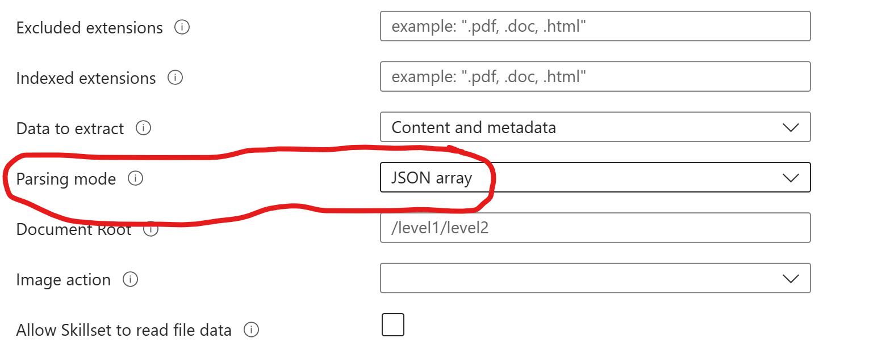

# Leveraging OpenAI and Azure Cognitive Search for Excel Data
## Introduction
This project aims to provide a basic framework for integrating Azure OpenAI and Azure Cognitive Search to interact with Excel data sources seamlessly. While in its alpha stage, the core functionality has been established, offering a solution to a gap I found with AOAI + Cognitive Search: efficiently querying Excel data with natural language. 
Before we begin, it is important to note that this is my first project of this type and my first Github creation. With that in mind, there is a high likelihood that some aspects of getting to the outcome are inefficient and could be accomplished faster.

## Why Excel?
Excel documents are one of the most common data sources in many industries. It is one of my team’s most prolific sources. The ability to chat directly with this data streamlines the decision-making process, reduces the time spent on manual data retrieval and analysis, and – at least for my team – an ability to free up desk space and increase the scale of offerings by providing some self-service data queries for routine updates.

## Key Features
1.	Data Engineering with Python: Converts Excel sheets into structured JSON documents ready for indexing. Keep in mind the impact this has on your Cognitive Search utilisation.
2.	Azure Cognitive Search Indexing with C#: Efficiently creates an optimized search index tailored for my Excel data.
3.	Integration with Azure OpenAI: Using the Azure Samples Demo as the starting point, it combines the power of OpenAI and Azure Cognitive Search to allow for natural language queries on Excel data.
4.	Flask: A quick Flask app backend with a simple frontend UI for demonstration and further testing and refinement.


## Quick Setup
As with the [Azure-Search-OpenAI-Demo](https://github.com/Azure-Samples/azure-search-openai-demo) project, an Azure subscription with access to Azure OpenAI, a configured Azure Cognitive Search, and an Azure Storage like CosmosDB, Blob, or ADLS Gen 2 resource is necessary. I use ADLS Gen 2 at present. 

## Usage
For the time being, I left out Langchain and vector embeddings to keep it in the aim small miss small approach and get something working. 
Here is the export of the requirements in my virtual environment.

### Requirements
```plaintext
blinker==1.6.2
certifi==2023.7.22
cffi==1.15.1
charset-normalizer==3.2.0
click==8.1.7
colorama==0.4.6
cryptography==41.0.3
et-xmlfile==1.1.0
Flask==2.3.3
frozenlist==1.4.0
idna==3.4
isodate==0.6.1
itsdangerous==2.1.2
Jinja2==3.1.2
MarkupSafe==2.1.3
msal==1.23.0
msal-extensions==1.0.0
multidict==6.0.4
numpy==1.25.2
openai==0.27.8
openpyxl==3.1.2
pandas==2.1.0
pandas-stubs==2.0.3.230814
portalocker==2.7.0
pycparser==2.21
PyJWT==2.8.0
python-dateutil==2.8.2
python-dotenv==1.0.0
pytz==2023.3.post1
pywin32==306
requests==2.31.0
six==1.16.0
tqdm==4.66.1
types-pytz==2023.3.0.1
typing_extensions==4.7.1
tzdata==2023.3
urllib3==2.0.4
Werkzeug==2.3.7
xlrd==2.0.1
yarl==1.9.2
```
Given that this is a big stretch project for me and there are a few moving pieces with Excel, a lot of iterations ensued, so logging is heavily featured.

For credentialing, environmental, variables, and configuring the OpenAI SDK and Azure Cognitive Search and Storage Clients, I stuck fairly close to the Demo project. Referring back to it was helpful.
I needed to index my Excel files in a way that Cognitive Search and AOAI could work together, given the existing demo’s focus on PDF and other file types compatible with Azure Document Intelligence. 
To handle the compatibility issues that I was running into for Excel I looked at various means data engineers use to handle ETL work and a format that Azure Cognitive Search already handled well. I settled on python + pandas + BytesIO. It seemed the easiest lift and one most would be familiar with. This approach allowed me the ability to export the Excels to structured JSON objects.
```python
# Iterate over all files in Container
blobs = container_client.list_blobs()
for blob in blobs:
    # Process only Excel Files
    if not blob.name.endswith('xlsx'):
        continue

    print(f"Processing file: {blob.name}")

    # Download the file
    blob_client = container_client.get_blob_client(blob.name)
    blob_data = blob_client.download_blob().readall()

    # Use BytesIO to convert file
    from io import BytesIO

    # Convert Excel file into dataframes
    xls = pd.ExcelFile(BytesIO(blob_data))
    sheet_to_df_map = {}
    for sheet_name in xls.sheet_names:
        if sheet_name == "Overview":
            continue
        df = xls.parse(sheet_name)
        df['sheetName'] = sheet_name  # Add a new column with the sheet name
        df['FileName'] = blob.name.split('/')[-1].split('.')[0]
        print(f"Setting FileName as: {df['FileName'].iloc[0]} for blob: {blob.name}")
        df.rename(columns=lambda x: re.sub(r'\W+', '', x.replace(' ', '_').replace('%', 'Percent').replace('*', '').replace('1y', 'OneY')), inplace=True)
    
        # Rename Unnamed Columns
        if 'Unnamed_0' in df.columns:
            df.rename(columns={'Unnamed_0' : 'Type'}, inplace=True)

        # Create UniqueId
        df['UniqueId'] = df['FileName'] + '_' + df['sheetName'] + '_' + df.index.astype(str)
        sheet_to_df_map[sheet_name] = df

    # Convert dataframes into JSON and store back into ADLS
    for sheet_name, df in sheet_to_df_map.items():
        json_directory = "{directory1}/"
        json_file_name = "{directory}/" + df['FileName'].iloc[0] + "_" + sheet_name + ".json"
        print(f"Attempting to save to: {json_file_name}")
        json_str = df.to_json(orient='records')
        json_blob_client = blob_service_client.get_blob_client(container=container_name, blob=json_file_name)
        json_blob_client.upload_blob(json_str, overwrite=True)
```
You will also notice that I added some minor transformation work during the export. I interjected these to align with the Cognitive Search expected Index format: primarily the need for Fields to begin with a letter and not special characters or numbers, to not have empty column headers, and to have the UniqueID for each indexed record. I then had the JSON documents uploaded back into a new directory to simplify the Data source and Indexer builds inside of Cognitive Search. 
Next came creating the Index for the Excel files and new JSON objects. First, I enabled the Semantic Search in my Cognitive Search Index.
Then came building the actual Index. I used C# for this bit. The use of C# stemmed from issues configuring the Azure Search Preview SDK + Python to enable semantic search with my Index. Let’s chalk that up to I didn’t know what I was doing and just needed to make it work in the fastest way possible.
```C#
using System;
using Azure;
using Azure.Search.Documents;
using Azure.Search.Documents.Indexes;
using Azure.Search.Documents.Indexes.Models;
using Azure.Search.Documents.Models;

namespace AzureSearchSemanticIndexTest
{
    class Program
    {
        static void Main(string[] args)
        {
            string serviceName = "<MY-SEARCH-SERVIC>";
            string apiKey = "<YOUR-SEARCH-ADMIN-API-KEY>";
            string indexName = "<MY-INDEX>";

            // Create a SearchIndexClient to send create/delete index commands
            Uri serviceEndpoint = new Uri($"https://{serviceName}.search.windows.net/");
            AzureKeyCredential credential = new AzureKeyCredential(apiKey);
            SearchIndexClient adminClient = new SearchIndexClient(serviceEndpoint, credential);

            // Create a SearchClient to load and query documents
            SearchClient srchclient = new SearchClient(serviceEndpoint, indexName, credential);

            // Create index
            Console.WriteLine("{0}", "Creating index...\n");
            CreateIndex(indexName, adminClient);
        }

        private static void CreateIndex(string indexName, SearchIndexClient adminClient)
        {
            FieldBuilder fieldBuilder = new FieldBuilder();
            var searchFields = fieldBuilder.Build(typeof(MyIndex));

            var definition = new SearchIndex(indexName, searchFields);

            SemanticSettings semanticSettings = new SemanticSettings();
            semanticSettings.Configurations.Add(new SemanticConfiguration
            (
                "default",
                new PrioritizedFields()
                {
                    TitleField = new SemanticField { FieldName = "FileName" }, // Ensured FileName was a string
                    ContentFields = {
                        // Include only fields of type string
                        new SemanticField { FieldName = "Field1" },
                        new SemanticField { FieldName = "Field2" },
                        // Truncated for Brevity
                    },
                    KeywordFields = {
                        // Include only fields of type string, or fields you consider to be keywords
                        new SemanticField { FieldName = "Field 1" },
                        new SemanticField { FieldName = "Field2" },
                        // Truncated for Brevity
                    }
                })
            );

            definition.SemanticSettings = semanticSettings;

            adminClient.CreateOrUpdateIndex(definition);
        }
    }

    public class MyIndex
    {
        [SearchableField(IsSortable = true, IsFilterable = true)]
        public string Field1 { get; set; }

        [SearchableField(IsSortable = true, IsFilterable = true)]
        public string Field2 { get; set; }
	  // Truncated for Brevity
        
    }

}
```

When configuring the indexer, I used the advanced settings to set the parsing mode to JSON array.


This resulted in a little over 30,000 indexed documents. I tested the ‘*’ query in my Index to make sure it was returning the unique records of the JSON objects with all fields populated with either the data for the original Excel Sheet and Column or ‘null’ where the column was not present in any specific Excel Sheet. 

It is also important to edit the 'KB' sections to match the structure of the Index. I went with KB_Fields as an array.
```python
# Set the Environments
…{see the AOAI + Cognitive Search official demo project linked above}
KB_FIELDS = [
    "IndexCol1", " IndexCol2", " IndexCol3 IndexCo4", …{truncated for brevity}
```
Given my JSON objects indexed over 30,000 records, I focused on semantic search without vector embeddings for now to reduce the technical lift and time, but I did leave the code there and simply commented out for future iterations. 
```python
# Query Azure Cognitive Search Index
        filter = "category ne '{}'".format(exclude_category.replace("'", "''")) if exclude_category else None
        r = search_client.search(search, 
                         filter=filter,
                         query_type=QueryType.SEMANTIC, 
                         query_language="en-us", 
                         query_speller="lexicon", 
                         semantic_configuration_name="default", 
                         top=3)
```
Flask is being used for local testing.

## Challenges and Solutions
This project is a large stretch for me. It builds from a need to give my team a more scalable means of handling bespoke deliverables for routine update requests from a volume of Excel while having almost no budget. The initial exploration began with the Azure Samples GitHub demo. However, the out-of-the-box approach didn't fit the specific needs of querying Excel data. 

To get started, I could not use the entirety of the cloned repository. I was having too many issues trying to adapt the code as is, so I focused solely on the ChatReadRetrieveRead approach from the Demo by first adapting that Jupyter Notebook to my resources and getting it working.
This led to the development of a custom solution that involved data engineering with Python, Cognitive Search indexing with C#, and the integration of Azure OpenAI.
Next steps here are to go back and add some prompt engineering and vector search capabilities to improve the results of the querying the Excel reports.
Contributions

The project is in its early stages and while functional, it has room for optimization and additional features. Contributions are very welcome! If you find any bugs or have suggestions for improvements, please create an issue or submit a pull request.
## Acknowledgements

I am not a software engineer by any standard but have a background in data and intelligence systems. This project was a learning experience, and the code, while functional, definitely will benefit from refinement. I encourage contributions and feedback to make this a more robust solution for everyone. Without the team that created the demo to work from and some butchering on my part, this would have taken me a lot longer.


